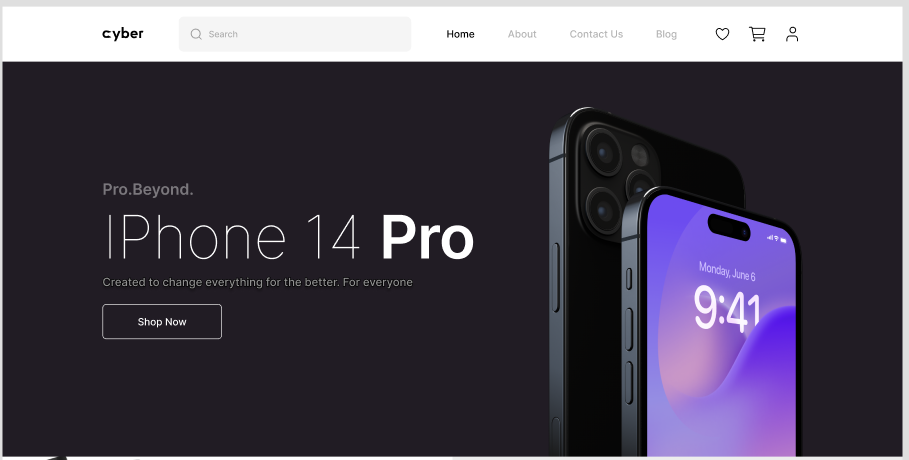
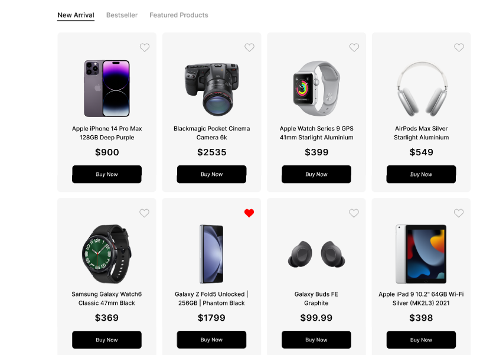
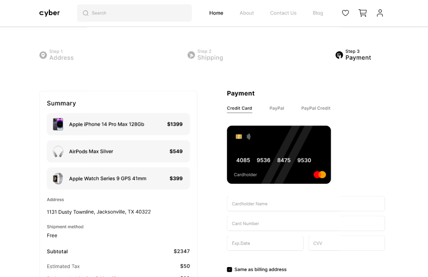

# 🛒 E-Store API

E-Store — bu online elektronika uchun savdo web site hisoblanadi.

---

## 📸 Demo





---

## 🎨 Figma Dizayn

👉 [Figma dizaynni bu yerda ko‘ring](https://www.figma.com/design/KGp8ly7fCLjO5ssq7sdSYp/E-Store---Mobile-web--Community-?node-id=366-5634)

---

## 🛠 Texnologiyalar

- **NestJS** – scalable backend framework
- **TypeORM** – ORM for PostgreSQL
- **PostgreSQL** – Ma’lumotlar bazasi
- **Nodemailer** – Email orqali OTP yuborish
- **Swagger** – API hujjatlari
- **dotenv** – maxfiy ma’lumotlar .env fayl orqali boshqariladi

---

## ⚙️ Ishga tushirish

```bash
# 1. Projectni klonlash
git clone https://github.com/ix1osbek/E-store.git
cd e-store

# 2. Paketlarni o‘rnatish
npm install

# 3. .env faylni sozlang
cp .env.example .env

# 4. PostgreSQL'ni ishga tushiring va ma’lumotlar bazasini ulang

# 5. Loyihani ishga tushiring
npm run start:dev
